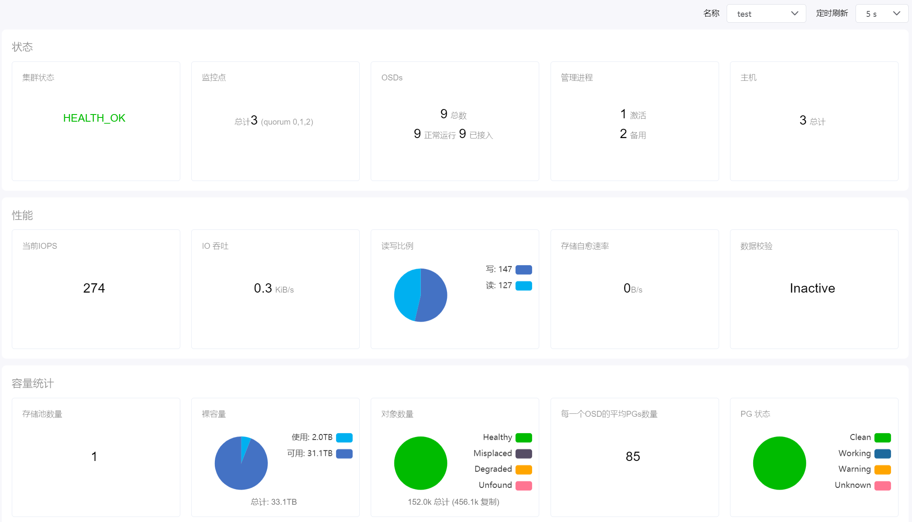
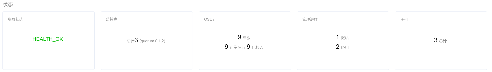
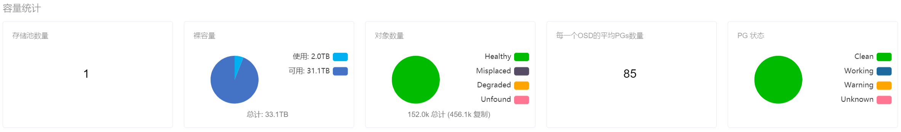

# 4.2.分布式存储监控

超级管理员在“资源管理”菜单下选择左侧“概览”的导航菜单，再点击“分布式存储监控”选项卡，即可看到分布式存储监控界面：

在此页面中，对当前平台的分布式存储监控信息进行了展示。

## 监控状态

实时显示当前集群的状态、监控点、OSDs、管理进程和主机的情况。

## 监控性能

实时显示当前集群的IOPS、IO吞吐、读写比例、存储自愈率和数据校验情况。

## 容量统计

实时显示当前集群的存储池数量、裸容量、对象数量、OSD平均PGs量和PG状态情况。