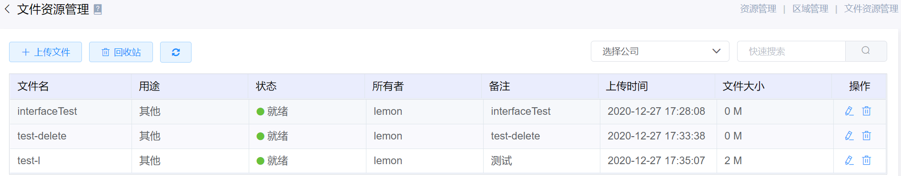
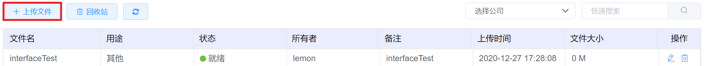

# 4.4.5文件资源管理

文件资源管理用于管理用户上传的文件，支持用户直接从镜像模块使用上传的文件注册镜像或ISO镜像。

在“资源管理”菜单下选择左侧“区域管理”导航菜单，之后点击“文件资源管理”的子菜单，即可看到文件资源的管理界面：

## 相关操作

HYPERX云管理平台支持用户对文件资源进行管理，支持的功能如下：

- 快速搜索：用户可以根据文件的名称、用途、状态等字段全局快速搜索文件；
- 高级筛选：用户可以从表头右侧根据文件的名称、用途、状态等字段筛选出符合条件的文件；
- 上传文件：用户可以上传文件到云平台，支持从镜像模块使用该文件注册镜像或ISO镜像；
- 编辑文件备注：用户可以编辑云平台文件资源的备注信息；
- 删除文件：用户可以将选定的文件资源移入回收站；
- 恢复文件：用户可以将选定的文件资源从回收站中移入文件资源列表；
- 彻底销毁文件：用户可以彻底销毁回收站中的文件资源。

操作入口如下：

- 资源管理→区域管理→文件资源管理

## 操作说明

### 上传文件

① 在文件资源管理界面中，点击“上传文件”按钮：

② 将会弹出“上传文件”的操作提示框，填写文件的名称、用途、备注等信息并上传文件附件后点击“创建”按钮，即可将文件上传至平台：

> *注：
>
> - 将文件上传至云平台后，可以从镜像模块使用该文件注册镜像或ISO镜像。

### 编辑文件备注

① 在文件资源管理界面中，选择需要编辑备注的文件，点击操作列的“编辑”按钮：

② 将会弹出“编辑文件备注“的操作提示框，编辑相关信息后，点击”确定“按钮，即可修改文件的备注信息：

### 删除文件

① 在文件资源管理界面中，选择需要删除的文件，点击操作列的“删除”按钮：

② 将会弹出“确认删除“的操作提示框，复核信息无误后，点击”确定“按钮，即可删除选定的文件：

> *注：
>
> - 从此入口删除文件后，该文件会被移入回收站，不会被彻底销毁，但不支持从镜像模块中使用。

### 恢复文件

① 在文件资源管理界面中，选择需要恢复的文件，点击“回收站”按钮：

② 将会弹出“回收站“的操作提示框，选择需要恢复至文件列表的文件，点击操作列的”恢复“按钮，将会将选定的文件恢复至文件列表：

### 彻底销毁文件

① 在文件资源管理界面中，选择需要彻底销毁的文件，点击“回收站”按钮：

② 将会弹出“回收站“的操作提示框，选择需要彻底销毁的文件，点击操作列的”删除“按钮，将会删除选定的文件：