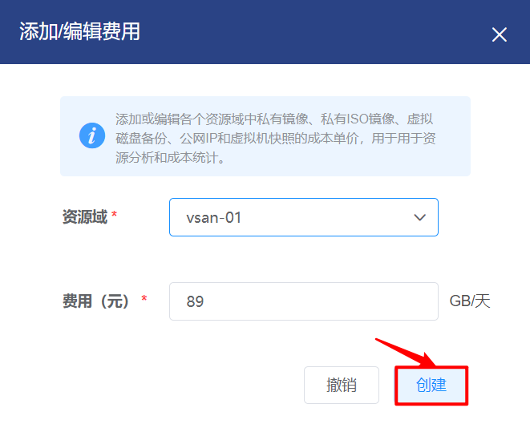
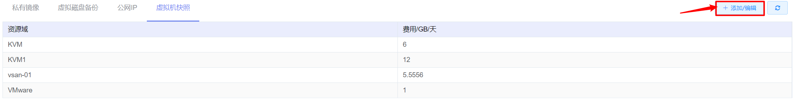
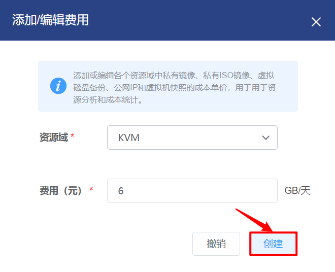

# 4.4.3.4.其他定价管理

管理员可以为平台中各个域的私有镜像、虚拟磁盘备份、公网IP和虚拟机快照配置价格，用于资源分析和成本统计。

在“资源管理”菜单下选择左侧“区域管理”导航菜单，之后点击“资源规格”下的“其他定价”子菜单，即可看到其他定价的管理界面：

在此页面，可以查看资源域的名称和单价。

其他定价的管理界面分为私有镜像、虚拟磁盘备份、公网IP和虚拟机快照四个界面，默认显示的是私有镜像的定价界面。

## 相关操作

HYPERX云管理平台支持用户对其他定价进行管理，支持的功能如下：

- 添加/编辑私有镜像价格：添加或编辑选定资源域私有镜像的单价；

- 添加/编辑虚拟磁盘备份价格：添加或编辑选定资源域虚拟磁盘备份的单价；

- 添加/编辑公网IP价格：添加或编辑选定资源域公网IP的单价；

- 添加/编辑虚拟机快照价格：添加或编辑选定资源域虚拟机快照的单价。

操作入口如下：

- 资源管理→区域管理→资源规格→其他定价

## 操作说明

### 编辑私有镜像定价

① 在其他定价管理界面中，点击“私有镜像”选项卡，点击操作列的“添加/编辑”按钮：

② 将会弹出“添加/编辑费用”的操作提示框，选择资源域并填写费用后，点击“创建”按钮，编辑私有镜像的定价：

### 编辑虚拟磁盘备份定价

① 在其他定价管理界面中，点击“虚拟磁盘备份”选项卡，点击操作列的“添加/编辑”按钮：

② 将会弹出“添加/编辑费用”的操作提示框，选择资源域并填写费用后，点击“创建”按钮，编辑虚拟磁盘备份的定价：

### 编辑公网IP定价

① 在其他定价管理界面中，点击“公网IP”选项卡，点击操作列的“添加/编辑”按钮：

② 将会弹出“添加/编辑费用”的操作提示框，选择资源域并填写费用后，点击“创建”按钮，编辑公网IP的定价：

### 编辑虚拟机快照定价

① 在其他定价管理界面中，点击“虚拟机快照”选项卡，点击操作列的“添加/编辑”按钮：

② 将会弹出“添加/编辑费用”的操作提示框，选择资源域并填写费用后，点击“创建”按钮，编辑虚拟机快照的定价：

