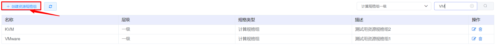
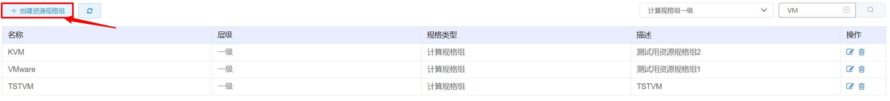
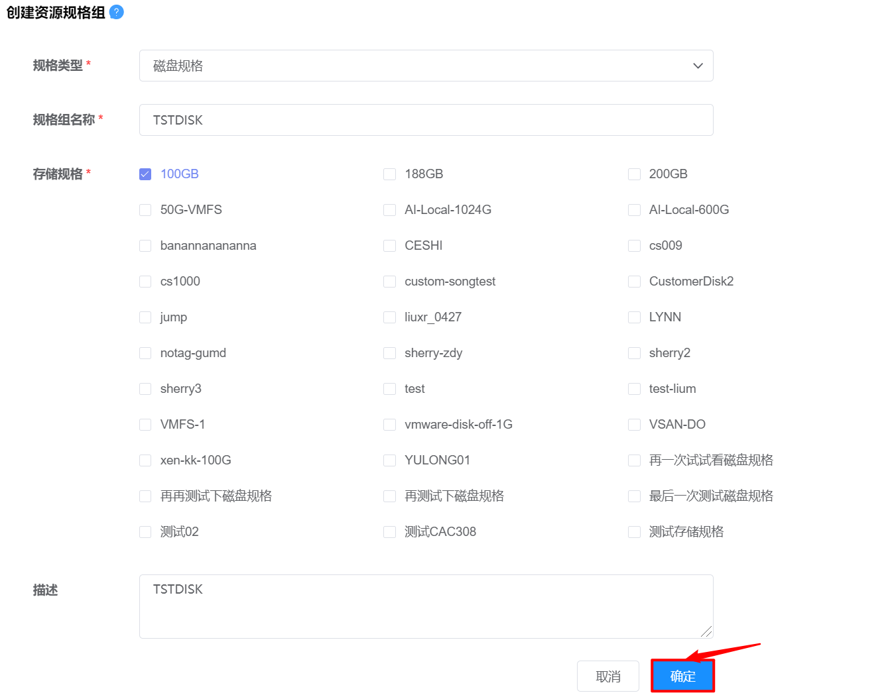
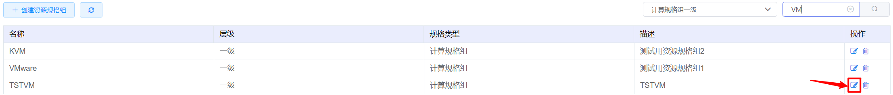
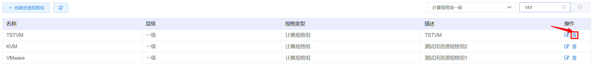

# 4.4.3.5.资源规格组管理

资源规格组是用户创建虚拟机选择规格组的分类，管理员可以配置多个规格组供用户选择。

在“资源管理”菜单下选择左侧“区域管理”导航菜单，之后点击“资源规格”下的“资源规格组”子菜单，即可看到资源规格组的管理界面：

在此页面，可以查看资源规格组的名称、层级、规格类型等信息。

其中，云平台支持对虚拟机规格和磁盘规格配置资源规格组，虚拟机规格支持配置两层分类。

## 相关操作

HYPERX云管理平台支持用户对资源规格组进行管理，支持的功能如下：

- 规格组层级选择：只显示选定规格组层级下的资源规格组名称，默认为虚拟机规格组一级；
- 快速搜索：根据资源规格组的名称、层次、规格类型等字段全局快速搜索资源规格组；
- 创建虚拟机规格的资源规格组：选择虚拟机规格组的类型及层级，填写名称并关联规格后，创建新的虚拟机资源规格组；
- 创建磁盘规格的资源规格组：选择磁盘规格组的类型，填写名称并关联规格后，创建新的存储资源规格组；
- 编辑资源规格组：编辑资源规格组的名称、规格、描述等信息；
- 删除资源规格组：删除选定的资源规格组。

操作入口如下：

- 资源管理→区域管理→资源规格→资源规格组

## 操作说明

### 创建虚拟机规格的资源规格组

① 在资源规格组管理界面中，点击“创建资源规格组”按钮：

② 选择“虚拟机规格”规格类型后，选择资源规格组的层级和关联的规格组，填写规格组名称和描述后，点击“确定”按钮创建虚拟机规格的资源规格组：

> *注：
>
> - 二级规格组显示的是未被分配给一级规格组的选项；
>- 若选择的层级为Level2，需要选择关联的虚拟机规格；
> - 若选择的层级为Level2，关联的虚拟机规格显示的是未被关联二级规格组的虚拟机规格。
>

### 创建磁盘规格的资源规格组

① 在资源规格组管理界面中，点击“创建资源规格组”按钮：

② 选择“磁盘规格”规格类型后，选择资源规格组关联的磁盘规格，填写规格组名称和描述后，点击“确定”按钮创建磁盘规格的资源规格组：

> *注：
>
> - 磁盘规格显示的是未被分配给磁盘规格组的选项。
>

### 编辑资源规格组

① 在资源规格组管理界面中，选择需要编辑的资源规格组，点击操作列的“编辑”按钮：

② 进入“编辑资源规格组”的页面，修改规格组的名称、关联规格、说明等信息后，点击“确定”按钮，更新资源规格组的信息：

### 删除资源规格组

① 在资源规格组管理界面中，选择需要删除的资源规格组，点击操作列的“删除”按钮：

② 将会弹出“删除确认”的操作提示框，点击“确定”按钮，删除选定的资源规格组：

