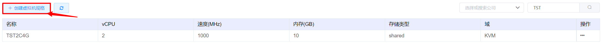
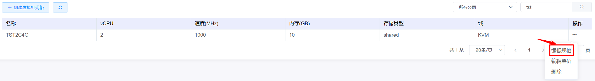
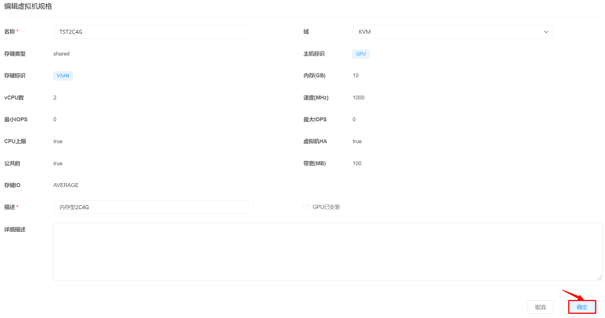
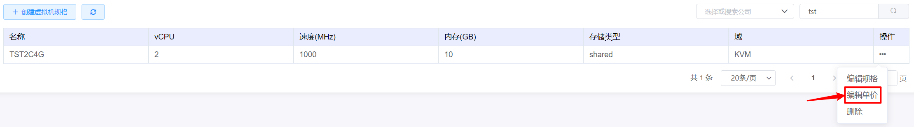
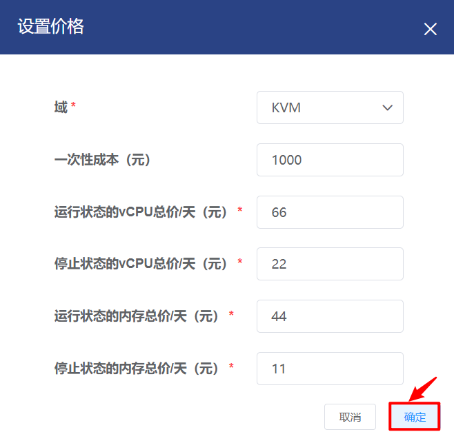
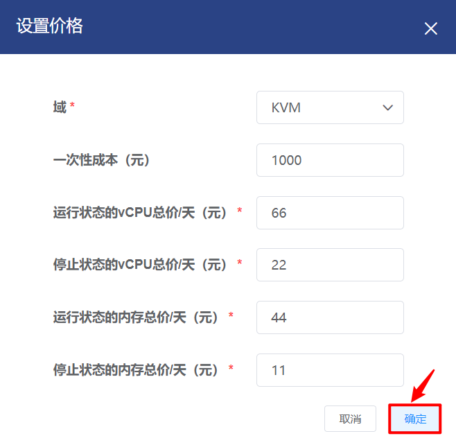
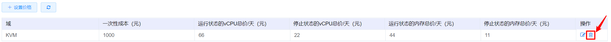

# 4.4.3.1.虚拟机规格管理

虚拟机规格是用户创建虚拟机所需要的规格方案，管理员可以创建多个虚拟机规格供用户选择。

在“资源管理”菜单下选择左侧“区域管理”导航菜单，之后点击“资源规格”下的“虚拟机规格”子菜单，即可看到虚拟机规格的管理界面：

在此页面，可以查看虚拟机规格的名称、vCPU、速度等信息。

## 相关操作

HYPERX云管理平台支持用户对虚拟机规格进行管理，支持的功能如下：

- 搜索公司：只显示所选公司的私有虚拟机规格；
- 快速搜索：根据虚拟机规格的名称、类型、Zone等字段全局快速搜索虚拟机规格；
- 创建虚拟机规格：输入虚拟机规格的名称、域、存储类型等信息创建新的虚拟机规格；
- 编辑虚拟机规格：编辑虚拟机规格的名称、域、描述等相关信息；
- 编辑虚拟机规格单价：为虚拟机规格创建、编辑或删除单价信息；
- 删除虚拟机规格：删除选定的虚拟机规格，其操作结果不影响之前使用该规格创建的虚拟机。

操作入口如下：

资源管理→区域管理→资源规格→虚拟机规格

## 操作说明

### 创建虚拟机规格

① 在虚拟机规格管理界面中，点击“创建虚拟机规格”按钮：

② 将会进入“创建虚拟机规格”的页面，填写虚拟机规格的名称、存储类型、主机标识等信息后，点击“创建”按钮创建新的虚拟机规格：

*注：

> - 存储类型分为“share”（使用共享存储的主存储）和“local”（使用计算节点的本地磁盘）；
>- 设置主机标识后，系统将指定虚拟机运行在带有相同标识的主机节点上；
> - 设置存储标识后，系统将虚拟机镜像文件创建在带有相同标识的主存储中；
>- QOS类型为存储管理机制，分为“Hypervisor”（通过管理程序来管理）和“Storage”（通过控制存储性能来管理），需确保管理程序或存储系统支持此功能；
> - 速度为vCPU的频率，其频率不支持超过物理CPU主频的上限；
>- 若允许虚拟机使用超过本虚拟机规格中设定的CPU频率上限的CPU频率，则勾选“CPU上限”复选框；
> - 若需要启用高可用，则勾选“启用HA”复选框，当虚拟机所运行的主机出现意外宕机、断电、断网等情况时，系统将自动在同一集群的另一台主机上自动重启这台虚拟机；
>- 若设置该虚拟机规格公用，则勾选“公共的”复选框，若未勾选，需选择私有使用虚拟机规格的公司；
> - 若需要自定义资源限制，则勾选“自定义”复选框，自定义内存、vCPU、速度的大小区间；
>- 带宽为限制虚拟机使用的网络带宽，为空表示不限制。目前只支持KVM和XenServer，其中XenServer支持设置的最大带宽为200MB；
> - 若需要为虚拟机规格配置GPU，勾选“GPU已安装”复选框，选择GPU应用的管理程序和最大GPU量。
>

### 编辑虚拟机规格

① 在虚拟机规格管理界面中，选择需要编辑的虚拟机规格，点击操作列的“编辑规格”按钮：

② 将会进入“编辑虚拟机规格”的页面，编辑虚拟机规格的名称、域、描述等信息后，点击“确定”按钮更新虚拟机规格信息：

### 创建虚拟机规格单价

① 在虚拟机规格管理界面中，选择需要创建单价的虚拟机规格，点击操作列的“编辑单价”按钮：

② 将会进入编辑虚拟机单价的页面，点击“设置价格”按钮：

③ 在弹出的操作提示框中填写定价信息后，点击“确定”按钮，添加新的计算单价：

### 编辑虚拟机规格单价

① 在虚拟机规格管理界面中，选择需要编辑单价的虚拟机规格，点击操作列的“编辑单价”按钮：

② 将会进入编辑虚拟机单价的页面，选择需要编辑的单价，点击操作列的“编辑”按钮：

③ 在弹出的操作提示框中修改相关信息后，点击“确定”按钮，即可编辑虚拟机规格的单价：

### 删除虚拟机规格单价

① 在虚拟机规格管理界面中，选择需要删除单价的虚拟机规格，点击操作列的“编辑单价”按钮：

② 将会进入编辑虚拟机单价的页面，选择需要删除单价，点击操作列的“删除”按钮：

③ 将会弹出“删除确认”的操作提示框，点击“确定”按钮，删除选定的虚拟机规格单价：

### 删除虚拟机规格

① 在虚拟机规格管理界面中，选择需要删除的虚拟机规格，点击操作列的“删除”按钮：

② 将会弹出“删除确认”的操作提示框，点击“确定”按钮，删除选定的虚拟机规格：

> *注：
>
> - 虚拟机规格被删除后，使用该规格的虚拟机不受影响。