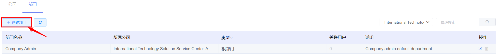
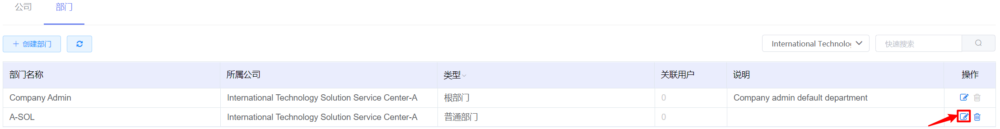
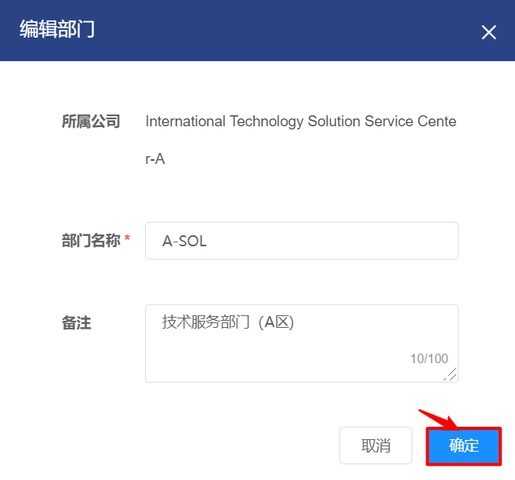

# 5.1.2.部门管理

在“企业管理”菜单下选择左侧“组织管理”的导航菜单，之后点击“部门”的子菜单，即可看到部门的管理界面：

在部门管理界面，可以查看当前平台已有全部部门信息，包括部门的名称、所属公司、部门类型和说明等信息。

## 相关操作

HYPERX云管理平台支持超级管理员和业务管理员对部门进行管理，支持的功能如下：

- 搜索公司：只显示所选公司的所有部门；
- 快速搜索：根据部门的名称、部门类型、说明等字段全局快速搜索部门；
- 添加部门：在选定的公司中添加一个新的部门，并为部门分配初始配额；
- 编辑部门：编辑部门的名称和备注信息；
- 删除部门： 删除选中的部门，但在删除公司前需要删除部门关联的资源，或将部门关联的资源移动到其他部门或公司下。

操作入口如下：

- 企业管理→组织管理→部门

## 操作说明

### 部门的创建

① 在部门管理界面中，点击“创建部门”按钮：

② 将会进入创建部门的界面，选择部门所属公司，填写部门名称、配置部门初始配额并填写相关备注后，点击“确定”按钮，即可成功创建新部门：

### 部门的编辑

① 在部门管理界面中，选择需要编辑的部门后，点击操作列的“编辑”按钮：

② 将会弹出“编辑部门”的操作提示框，修改部门名称和相关备注信息后，点击“确定”按钮，更新部门信息：

> *注：
>
> - 部门所属的公司不支持修改。
>

### 部门的删除

① 在部门管理界面中，选择需要删除的部门，点击操作列的“删除”按钮：

② 将会弹出“删除确认”的操作提示框，点击“确认”按钮后，将删除选中的部门：

> *注：
>
> - 每个公司的根部门不支持删除。