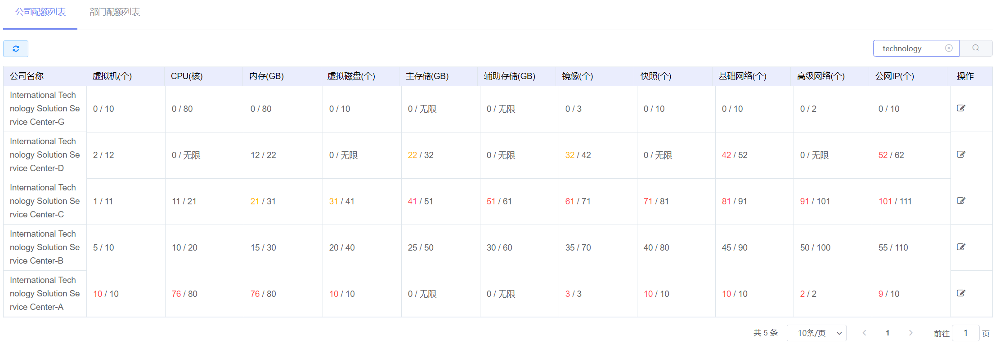
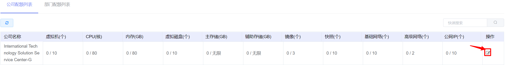
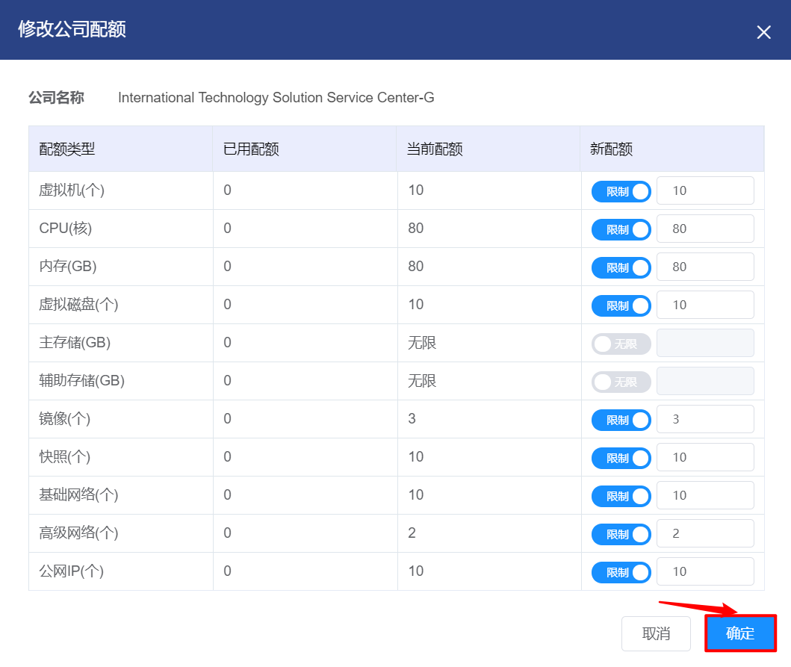
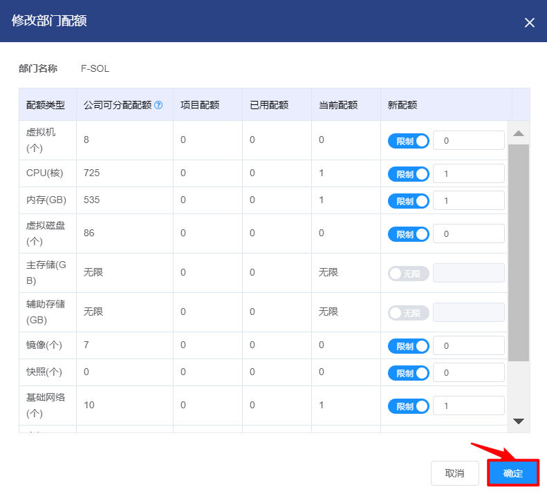

# 5.4.配额管理

配额是指管理员为公司、部门或项目设置的可用额度，用户在申请资源时若超出配额限制则会告警申请失败。

管理员可以在云平台中查看各个公司和部门虚拟机、CPU、内存等资源的配额的分配和使用情况，也可以编辑配额的额度。

在“企业管理”菜单下选择左侧“配额管理”导航菜单，即可看到配额的管理界面：

在此页面，可以查看公司或部门虚拟机、CPU、内存等指标的用量和配额。

当用量与配额的比值超过60%，将会用橙色显示用量；当比值超过80%，将会用红色显示用量。

配额的管理界面分为公司配额和部门配额两个界面，默认显示的是公司配额界面。

## 相关操作

HYPERX云管理平台支持超级管理员和业务管理员对公司和部门的配额进行管理，支持的功能如下：

- 快速搜索：根据公司的名称或部门名称等字段全局快速搜索公司；

- 公司配额的编辑：编辑公司内虚拟机、CPU、内存等指标的配额可用量；

- 部门配额的编辑：编辑部门内虚拟机、CPU、内存等指标的配额可用量。

> *注：
>
> - 超级管理员可以查看和配置公司的配额，业务管理员可以查看和配置部门的配额，普通用户没有查看和配置的权限。
>

操作入口如下：

- 企业管理→配额管理→公司配额列表

- 企业管理→配额管理→部门配额列表

## 操作说明

### 编辑公司配额

① 在配额管理界面中，选择“公司配额列表”选项卡。选择需要编辑配额的公司后，点击操作列的“编辑”按钮：

② 将会弹出“修改公司配额”的操作提示框，编辑相关配额后，点击“确定”按钮，更新公司配额信息：

> *注：
>
> - 超级管理员也可以在“企业管理→组织管理→公司”菜单下，点击操作列的“编辑”按钮，编辑公司的配额。
>

### 编辑部门配额

① 在配额管理界面中，选择“部门配额列表”选项卡。选择需要编辑配额的部门后，点击操作列的“编辑”按钮：

② 将会弹出“修改部门配额”的操作提示框，编辑相关配额后，点击“确定”按钮，更新部门配额信息：

> *注：
>
> - 超级管理员也可以在“企业管理→组织管理→公司”菜单下，点击操作列的“编辑”按钮，编辑公司根部门的配额。