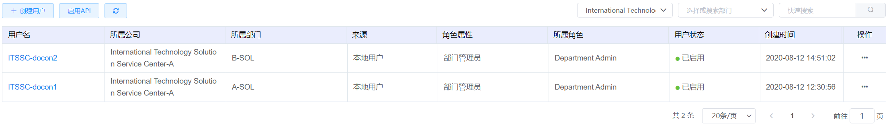
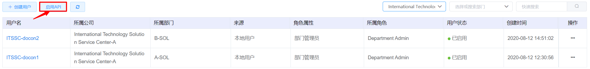
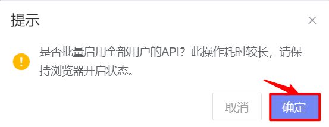
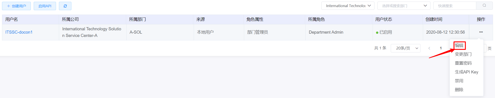
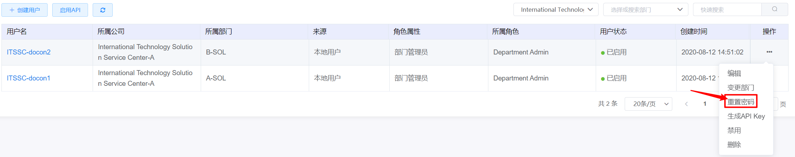
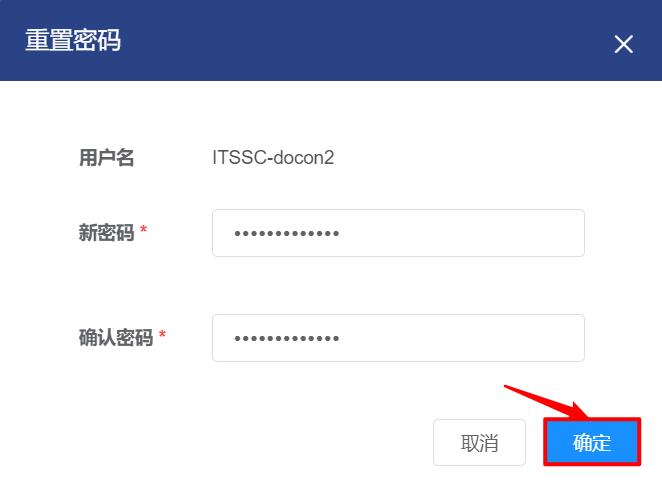
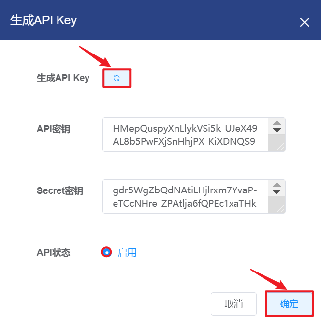
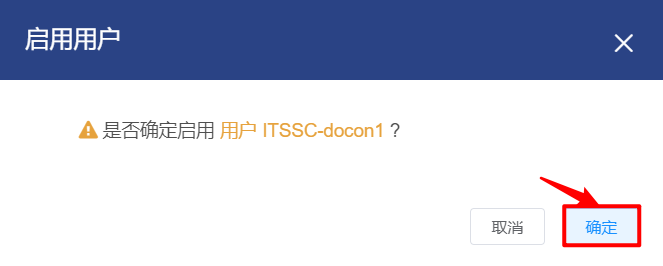
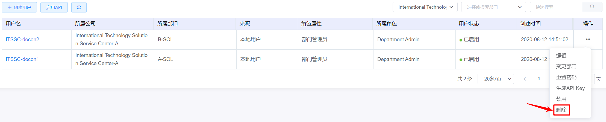
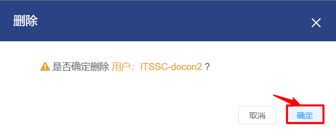

# 5.3.用户管理

用户是拥有独立的账号和密码，被分配指定角色权限，使用云平台的群体。

在“企业管理”菜单下选择左侧“用户”的导航菜单，即可看到用户的管理界面：

在用户管理界面，可以查看当前平台已有全部用户信息，包括用户的名称、所属公司、所属部门等信息。

## 相关操作

HYPERX云管理平台支持超级管理员、业务管理员和部门管理员对用户进行管理，支持的功能如下：

- 搜索公司：只显示所选公司的所有用户；
- 搜索部门：只显示所选部门的所有用户；
- 快速搜索：根据用户的名称、角色属性、所属角色等字段全局快速搜索用户；
- 创建用户：创建一个新的用户，并填写用户的来源、用户名、所属公司等初始信息；
- 启用API：批量启用全部用户的API；
- 编辑用户：编辑用户的用户名、邮箱、显示名等信息；
- 变更用户部门：修改用户的部门、角色名称、接管资源的用户等信息；
- 重置用户密码：重置用户的登录密码；
- 生成用户的API Key：生成、启用、重置用户的API key；
- 禁用/启用用户：禁用一个用户，被禁用的用户不能登录云平台/启用被禁用的用户，用户被启用后可正常访问云平台；
- 删除用户： 删除选中的用户。

操作入口如下：

- 企业管理→用户

## 操作说明

### 创建用户

① 在用户管理界面中，点击“创建用户”按钮：

② 将会弹出“创建用户”的操作提示框，填写用户的来源、用户名、所属公司等信息后，点击“确定”按钮，即可成功创建新用户：

> *注：
>
> - 每个部门必须存在“部门管理员”属性角色的用户，才能创建“普通用户”属性角色的用户。
>

### 启用API

①在用户管理界面中，点击“启用API”按钮：

②将会弹出如下提示框，点击“确定”按钮，将批量启用全部用户的API：

### 编辑用户

① 在用户管理界面中，选择需要编辑的用户后，点击操作列的“编辑”按钮：

② 将会弹出“编辑用户”的操作提示框，修改用户名、邮箱、显示名等信息后，点击“确定”按钮，更新用户信息：

> *注：
>
> - 电话号码只允许输入手机号码。

### 变更用户部门

① 在用户管理界面中，选择需要重置密码的用户后，点击操作列的“变更部门”按钮：

② 将会弹出“变更部门”的操作提示框，编辑新部门、新角色名称、接管资源的用户等信息后，点击“确定”按钮，变更用户的部门信息：

> *注：
>
> - 资源变更选择不开启，且用户名下有虚拟机、虚拟磁盘、网络等资源时，必须选择接管资源的用户；
> - 资源变更选择开启，且用户名下的虚拟机选用的是隔离网络时，如果选择接管资源的用户，虚拟机将会转给该用户；否则虚拟机将会转给公司管理员。

### 重置用户密码

① 在用户管理界面中，选择需要重置密码的用户后，点击操作列的“重置密码”按钮：

② 将会弹出“重置密码”的操作提示框，输入新密码并确认复核后，点击“确定”按钮，重置用户的密码：

> *注：
>
> - 若重置密码的用户处于登录状态，则该用户注销后需要使用重置后的密码登录。
>

### 生成用户的API Key

① 在用户管理界面中，选择需要生成API Key的用户后，点击操作列的“生成API Key”按钮：

② 将会弹出“生成API Key”的操作提示框，点击刷新按钮后，“启用”自动选中，再点击“确定”按钮，生成并启用用户的API Key：

③再次打开“生成API Key”的操作提示框，重新点击刷新按钮后，点击“确定”按钮，将重置用户的API Key：

### 禁用/启用用户

① 在用户管理界面中，选择需要禁用的用户后，点击操作列的“禁用”按钮：

② 将会弹出“禁用确认”的操作提示框，点击“确定”按钮，禁用选定的用户：

③ 在用户管理界面中，选择需要启用的用户后，点击操作列的“启用”按钮：

④ 将会弹出“启用确认”的操作提示框，点击“确定”按钮，启用选定的用户：

> *注：
>
> - 被禁用的用户注销后不能登录云平台，该用户名下的资源不受影响。
>

### 删除用户

① 在用户管理界面中，选择需要删除的用户后，点击操作列的“删除”按钮：

② 将会弹出“删除确认”的操作提示框，点击“确定”按钮，删除选定的用户：

> *注：
>
> - 若选中的用户名下有资源，则该用户不允许被删除。需要将当前用户面下的资源回收或迁移，才能删除当前用户。