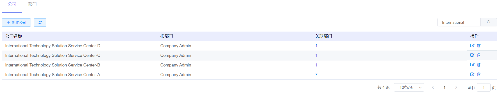
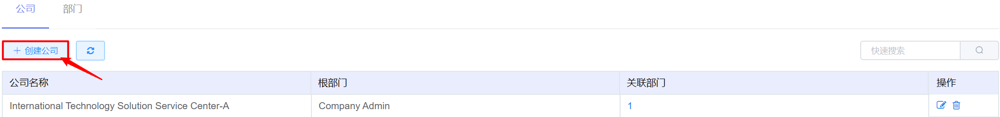
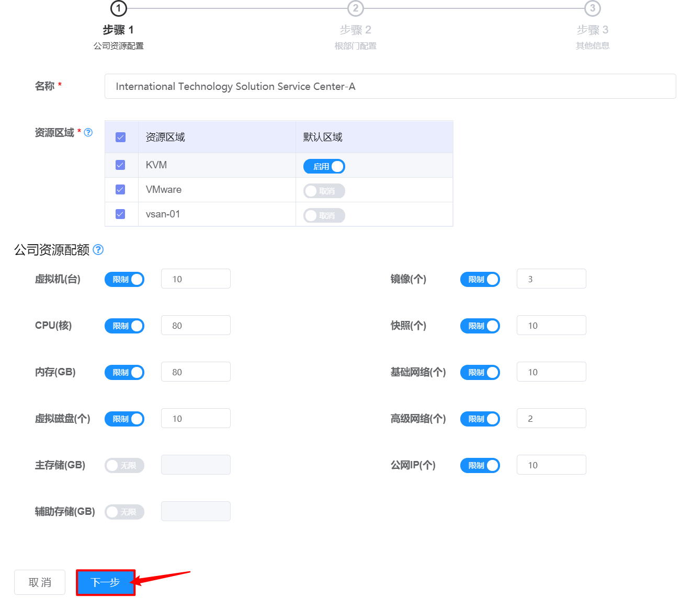
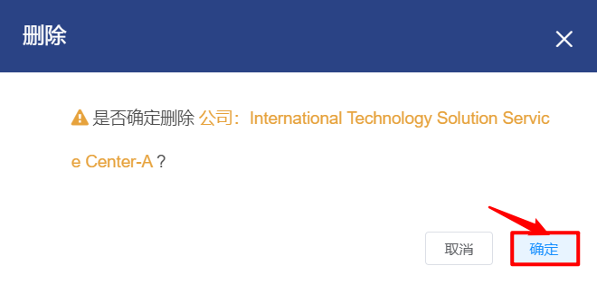

# 5.1.1.公司管理

在“企业管理”菜单下选择左侧“组织管理”的导航菜单，之后点击“公司”的子菜单，即可看到公司的管理界面：

在公司管理界面，可以查看当前平台已有全部公司信息，包括公司的名称、根部门、关联部门信息。

## 相关操作

HYPERX云管理平台支持超级管理员对公司进行管理，支持的功能如下：

- 快速搜索：根据公司的名称、根部门等字段全局快速搜索公司；

- 公司的创建：创建一个新的公司，并对公司进行“资源”、“根部门”和“其他信息”的初始化配置；

- 公司的编辑：编辑公司“资源”、“根部门”和“其他信息”的配置；

- 公司的删除：将选定的公司和公司下绑定的资源从云平台中删除。

操作入口如下：

- 企业管理→组织管理→公司

## 操作说明

### 公司的创建

① 在公司的管理界面中，点击“创建公司”按钮，将会进入创建公司的界面：

② 在创建公司的界面中，需要依次执行资源配置、根部门配置、其他信息配置这3个操作。

资源配置——配置公司的名称、资源区域、初始配额等信息。设置界面如下：

完善全部信息后，点击“下一步”按钮，进入下一步配置。

> *注：
>
> - 支持为公司选择多个资源区域，但需要设置一个默认区域。

根部门配置——配置公司的根部门名称和根部门配额信息，设置界面如下：

> *注：
>
> - 根部门的可用配额不能超过公司的配额；
>- 根部门将作为本公司初始部门，该部门内用户将被赋予查看该公司所有部门资源信息能力；
> - 如需调整根部门虚拟机、CPU、内存等资源的配额资源，请查阅配额管理章节；
>- 根部门创建后，需手动创建该部门的首角色，关于创建角色，请查阅角色管理章节。
> 

完善全部信息后，点击“下一步”按钮，进入下一步配置。

其他信息配置——配置公司详情描述、地址和主责联系人的相关信息，设置界面如下：

完善其他信息后，点击“确定”按钮，即可完成公司的创建。

### 公司的编辑

① 在公司管理界面中，选择需要编辑的公司后，点击操作列的“编辑”按钮：

② 将会进入编辑公司的页面，可以重新对公司进行资源配置、根部门配置和其他信息配置。

> *注：
>
> - 配置界面与创建公司界面相同，请查阅“公司的创建”章节。
>

### 公司的删除

① 在公司管理界面中，选择需要删除的公司，点击操作列的“删除”按钮：

② 将会弹出“删除确认”的操作提示框，点击“确定”按钮后，删除选定的公司：

> *注：
>
> - 如果该公司名下还有未销毁的资源，将提示用户依次销毁公司内的资源。

